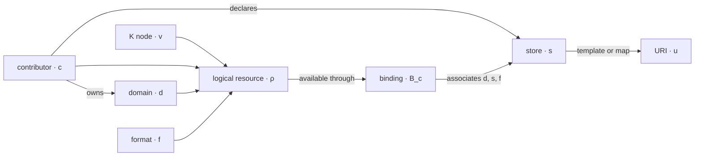

# Contributor protocol

This document defines the legacy protocol v1 compatibility adapter. The active
contract is [`CONTRIBUTOR-PROTOCOL-V2.md`](CONTRIBUTOR-PROTOCOL-V2.md).
Tether detects v1 explicitly and preserves its behavior; new contributors use
v2.

`contributor.toml` is the localized semantic bridge exposed by a content
contributor. It declares information only. Tether supplies the executable
query language and an explicit consumer-side materialization operation.

## Relations

For contributor $c$:

$$
D_c=\{\text{declared content domains}\}
$$

$$
S_c=\{\text{declared stores}\}
$$

$$
B_c\subseteq D_c\times S_c\times F
$$

The binding relation $B_c$ keeps domain semantics independent from physical
storage. A domain may bind to several stores, and one store may host several
domains.

The inventory attached to a binding materializes which K selectors are
currently available in that region of $B_c$.

## Resource identity

One accepted logical resource is:

$$
\rho=(v,c,d,f)
$$

Its durable key is `(K node id, contributor, domain, format)`. Its query form
is:

$$
\tau=(\sigma,(c,d,f))
$$

where $\sigma$ selects $v$ by immutable id, current rooted path, or both.

The logical resource has no separate name in protocol version 1. There is at
most one resource for a given `(node, contributor, domain, format)` tuple. A
second physical location is a replica of the same resource, not another
resource.

The resource is a leaf of the contributor overlay, not necessarily a TLF
`F`. Resources may be attached to `T`, `L`, `F`, or `Fd` K nodes.



This is not a prescribed topology inside a contributor. It is a queryable
semantic relation that can be projected by any of its axes.

## Complete example

```toml
version = 1

[contributor]
id = "research"

[domains.documents]
formats = ["md", "ipynb"]

[stores.local]
kind = "directory"
enabled = true
strategy = "template"
origin = "storage/local"

[stores.github]
kind = "remote"
enabled = true
strategy = "template"
origin = "https://raw.githubusercontent.com/Cohesian/research/main/storage/local"

[stores.google-drive]
kind = "remote"
enabled = false
strategy = "map"

[[bindings]]
domain = "documents"
store = "local"
formats = ["md", "ipynb"]
inventory = "storage/local/routes.toml"
pattern = "{path}.{format}"

[[bindings]]
domain = "documents"
store = "github"
formats = ["md", "ipynb"]
inventory = "storage/local/routes.toml"
pattern = "{path}.{format}"

[[bindings]]
domain = "documents"
store = "google-drive"
formats = ["md", "ipynb"]
inventory = "storage/google-drive/routes.toml"
```

## Contributor

`contributor.id` is the value of $c$ registered in K. A package describes one
contributor.

## Domains

Each `[domains.<name>]` table declares one $d\in D_c$ and the complete format
set admitted by that domain.

Domains describe meaning, not storage layout. A legacy package might expose a
`documents` or `videos` domain. Together, contributor and domain form the
ownership namespace—and logical partition keys—for their resource leaves.
They do not require matching physical directories.

A format normally names the resource's encoding or content shape: `md`,
`ipynb`, `mp4`, or a compound form such as `loci-project`. A compound resource
may resolve to a directory whose internal manifest names its entrypoint. The
logical format remains stable when a mapped Drive or YouTube URI has no visible
extension.

## Stores

Each `[stores.<name>]` table declares one $s\in S_c$:

| Field | Meaning |
|---|---|
| `kind` | `directory` for package-local files, otherwise `remote` |
| `enabled` | whether the store participates in discovery |
| `strategy` | deterministic `template` or explicit `map` |
| `origin` | required for directories and remote templates; package-relative for directories, absolute URI for remotes |

Stores describe infrastructure. They do not declare which content semantics
they contain, and they do not create new logical resources. They locate
replicas of resources declared through contributor domains.

## Bindings

Every `[[bindings]]` table adds one domain–store association:

| Field | Meaning |
|---|---|
| `domain` | an existing contributor domain |
| `store` | an existing contributor store |
| `formats` | the domain-format subset available through this binding |
| `inventory` | package-relative route inventory |
| `pattern` | required for template stores; omitted for map stores |

The same domain may appear in many bindings. The same store may also appear in
many bindings. A `(domain, store)` pair is unique within one protocol version.

## Inventories

All inventories use the same selector records:

```toml
version = 1

[[route]]
id = "ff647a5d-44f0-42af-9f01-abcadd04fb37"
path = "T-math/L-division/F-01-introduction"
format = "md"
```

For a template binding, the pattern derives the relative location. A
`location` field may be included as a checked assertion:

```toml
location = "T-math/L-division/F-01-introduction.md"
```

Because the contributor package and binding have already selected $c$, $d$,
and $s$, a deterministic lookup usually reduces to:

$$
(\operatorname{id}(v)\mid\operatorname{path}(v),f)
\longmapsto
\operatorname{URI}
$$

The physical layout is not prescribed:

```toml
pattern = "{path}.{format}"          # mirror the K grouping path
pattern = "{id}.{format}"            # flat, stable id-addressed storage
pattern = "{domain}/{path}.{format}" # partition a shared store by domain
```

Contributor and domain need not appear in the URI. They remain part of the
logical resource identity even when localization has already selected them.

For a remote map binding, every route includes its provider-controlled URI:

```toml
uri = "https://drive.google.com/..."
```

For a directory map binding, the store declares a package-relative `origin`
and each route uses a safe relative `location`:

```toml
[stores.local-videos]
kind = "directory"
enabled = true
strategy = "map"
origin = "videos/media/k_graph"

[[route]]
id = "ff647a5d-44f0-42af-9f01-abcadd04fb37"
path = "T-math/L-division/F-01-introduction"
format = "mp4"
location = "exports/division_final.mp4"
```

This supports portable contributor-owned files whose physical names do not
follow a deterministic K path template.

Checksums, revisions, timestamps, and access metadata may coexist with these
minimal fields. The resolver currently ignores metadata it does not need.

## Locality

All relative paths are evaluated from the directory containing
`contributor.toml` and must remain inside that contributor package. Secrets
and credentials are never protocol fields.

The process working directory is not a storage origin. This makes a cloned
contributor package portable regardless of where the resolver is invoked. A
future explicit runtime override may support externally mounted content
without weakening that default.

The contributor owns this document and its inventories. K only registers the
accepted $(v,c,d,f)$ contribution relation; consumers use Tether
to join that accepted view with contributor availability.

## Consumer layouts

`layout` is deliberately absent from `contributor.toml`. It is a consumer
projection selected at pull time, not another contributor domain, format, or
store property.

- `dir` materializes readable content as `K-rooted-path.format`.
- `map` preserves resolved provider URIs without transferring content.

Both layouts produce a consumer-owned `tether-manifest.json`. They do not
change logical resource identity, contributor inventories, store bindings, or
the accepted K graph. See [`MATERIALIZATION.md`](MATERIALIZATION.md).
